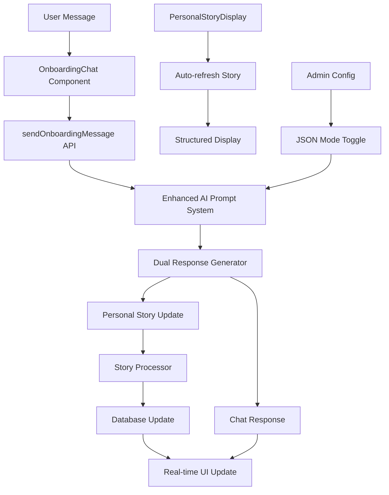

# Design Document

## Overview

The enhanced personal story generation system will transform the current AI interviewer from a basic text-response system into a sophisticated, real-time profile builder that captures both holistic user understanding and specific desired outcomes. The system will provide a magical user experience where the personal story evolves live during conversation, while building rich context for AI agents to discover unexpected networking opportunities.

## Architecture

### Current System Analysis

The existing system has these components:
- **OnboardingChat.tsx**: React component handling the conversation UI
- **PersonalStoryDisplay.tsx**: Component showing structured story sections
- **onboarding.ts**: Backend logic processing messages and updating stories
- **personal_stories table**: Database storing narrative, current_focus, seeking_connections, offering_expertise, summary, completeness_score

### Enhanced Architecture



## Components and Interfaces

### 1. Enhanced AI Response System

**New Response Format:**
```typescript
interface EnhancedAIResponse {
  chat_response: string;
  personal_story_update: {
    narrative: string;
    current_focus: string[];
    seeking_connections: string[];
    offering_expertise: string[];
    summary: string;
    completeness_score: number;
    desired_outcomes: string[];  // NEW FIELD
    personal_essence: {          // NEW FIELD
      values: string[];
      thinking_patterns: string[];
      energy_sources: string[];
      unique_perspective: string;
    };
    deep_context: string;        // NEW FIELD - Rich context for matching
  };
}
```

**Enhanced Database Schema:**
```sql
ALTER TABLE personal_stories ADD COLUMN desired_outcomes text[] DEFAULT '{}';
ALTER TABLE personal_stories ADD COLUMN personal_essence jsonb DEFAULT '{}';
ALTER TABLE personal_stories ADD COLUMN deep_context text DEFAULT '';
```

### 2. Dual-Mode Prompt System

**JSON Mode Prompt Template:**
```
You are {{agentName}}, conducting an onboarding interview with {{communicationStyle}} style.

CRITICAL: You must respond with BOTH a conversational message AND a structured story update.

Your response format:
1. First, provide your natural conversational response
2. Then add: "STORY_UPDATE:" followed by a JSON object

The JSON must include:
- narrative: Holistic 2-3 sentence story of who they are
- current_focus: What they're actively working on
- seeking_connections: Types of people/opportunities they need
- offering_expertise: What they can contribute
- desired_outcomes: Specific results they want to create
- personal_essence: { values, thinking_patterns, energy_sources, unique_perspective }
- deep_context: Rich paragraph for AI matching (not displayed to user)
- completeness_score: 0.0-1.0 based on understanding depth

Focus on understanding:
1. WHO they are authentically (values, perspective, what drives them)
2. WHAT outcomes they want to create in the world
3. HOW they think and approach problems
4. WHY they're passionate about their work
```

### 3. Real-time Story Updates

**Enhanced OnboardingChat Component:**
```typescript
// Add state for real-time story updates
const [personalStory, setPersonalStory] = useState<PersonalStory | null>(null);

// Enhanced message sending with dual response handling
const sendMessage = async () => {
  // ... existing logic ...
  
  const response = await internalAPIService.sendOnboardingMessage({
    // ... existing params ...
    jsonMode: true  // NEW: Enable structured responses
  });
  
  // Handle dual response
  setMessages(prev => [...prev, response.agentMessage]);
  
  if (response.personalStoryUpdate) {
    setPersonalStory(response.personalStoryUpdate);
    // Trigger real-time update to PersonalStoryDisplay
    onStoryUpdate?.(response.personalStoryUpdate);
  }
};
```

**Enhanced PersonalStoryDisplay Component:**
```typescript
// Add new sections for enhanced story data
const renderEnhancedStory = (story: EnhancedPersonalStory) => (
  <>
    {/* Existing sections */}
    <NarrativeSection narrative={story.narrative} />
    <CurrentFocusSection focus={story.current_focus} />
    <SeekingSection seeking={story.seeking_connections} />
    <OfferingSection offering={story.offering_expertise} />
    
    {/* NEW: Desired Outcomes Section */}
    <DesiredOutcomesSection outcomes={story.desired_outcomes} />
    
    {/* NEW: Personal Essence Section (collapsed by default) */}
    <PersonalEssenceSection essence={story.personal_essence} />
  </>
);
```

### 4. Admin Configuration System

**JSON Mode Toggle:**
```typescript
interface SystemConfig {
  onboarding_json_mode: boolean;
  story_update_frequency: 'every_turn' | 'every_few_turns';
  completeness_threshold: number;
}

// Admin panel toggle
const toggleJSONMode = async (enabled: boolean) => {
  await adminAPIService.updateSystemConfig({
    onboarding_json_mode: enabled
  });
};
```

## Data Models

### Enhanced Personal Story Model

```typescript
interface EnhancedPersonalStory {
  id: string;
  user_id: string;
  narrative: string;                    // Existing
  current_focus: string[];              // Existing
  seeking_connections: string[];        // Existing
  offering_expertise: string[];         // Existing
  summary: string;                      // Existing
  completeness_score: number;           // Existing
  
  // NEW FIELDS
  desired_outcomes: string[];           // Specific results they want to create
  personal_essence: {                   // Who they are authentically
    values: string[];
    thinking_patterns: string[];
    energy_sources: string[];
    unique_perspective: string;
  };
  deep_context: string;                 // Rich context for AI matching (not displayed)
  
  created_at: string;
  updated_at: string;
}
```

### Response Processing Model

```typescript
interface ProcessedAIResponse {
  chat_message: string;
  story_update: EnhancedPersonalStory | null;
  parsing_success: boolean;
  error_message?: string;
}
```

## Error Handling

### JSON Parsing Failures
1. **Graceful Degradation**: If JSON parsing fails, fall back to text-only mode for that turn
2. **Retry Logic**: Attempt to re-prompt the AI with clearer instructions
3. **User Notification**: Subtle indicator that story update was skipped (not error message)

### Real-time Update Failures
1. **Optimistic Updates**: Update UI immediately, rollback if database save fails
2. **Retry Mechanism**: Attempt to save story updates with exponential backoff
3. **Sync Recovery**: Periodic sync to ensure UI matches database state

### Completeness Score Validation
1. **Bounds Checking**: Ensure score stays between 0.0 and 1.0
2. **Progression Logic**: Score should generally increase over time
3. **Reset Handling**: Allow admin to reset scores for testing

## Testing Strategy

### Unit Tests
- JSON response parsing logic
- Story update merging algorithms
- Completeness score calculations
- Error handling scenarios

### Integration Tests
- End-to-end conversation flow with story updates
- Real-time UI synchronization
- Database consistency checks
- Admin configuration changes

### User Experience Tests
- Story evolution feels natural and accurate
- Real-time updates are smooth and non-disruptive
- Completeness progression matches conversation depth
- Error states are handled gracefully

### Performance Tests
- Response time with dual AI processing
- Database update frequency impact
- Real-time update scalability
- Memory usage with rich story data

## Implementation Phases

### Phase 1: Enhanced Data Model
- Add new database columns
- Update TypeScript interfaces
- Migrate existing data

### Phase 2: Dual Response System
- Enhance AI prompt templates
- Implement JSON parsing logic
- Add error handling

### Phase 3: Real-time UI Updates
- Modify OnboardingChat component
- Enhance PersonalStoryDisplay
- Add smooth transition animations

### Phase 4: Admin Configuration
- Add JSON mode toggle
- Implement configuration management
- Add monitoring and debugging tools

### Phase 5: Testing and Optimization
- Comprehensive testing suite
- Performance optimization
- User experience refinement